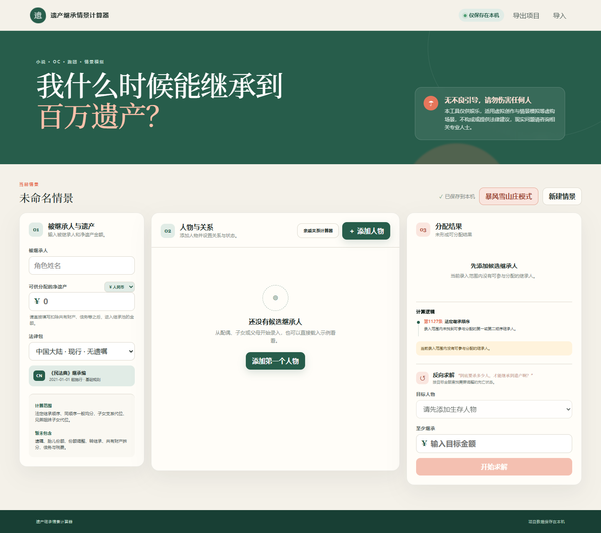

# 遗产继承情景计算器

一个面向小说、OC、跑团和其他虚构情景的本地无遗嘱继承计算器。用户可以录入遗产金额、人物关系和人物状态，查看法定继承顺序、代位继承路径、份额及金额，并对不同人物状态进行情景模拟。

本项目的程序代码由 AI 生成；产品构思、界面文案、调试与发布由本人完成。

[](https://ko-fi.com/tupetetodou)

当前内置法律包：**中国大陆现行法 · 无遗嘱继承基础规则**。



## 功能

### 继承计算

- 录入被继承人和可供分配的净遗产金额。
- 录入配偶、子女、父母、兄弟姐妹、祖父母、外祖父母及代位继承关系。
- 支持生存、先于被继承人死亡、放弃继承、丧失继承资格四种人物状态。
- 自动判断适用的法定继承顺序。
- 计算每位继承人的份额、比例和金额。
- 区分直接法定继承与代位继承，并显示计算依据。

### 反向求解

选择目标人物和目标金额，计算达到目标所需的最少“先于被继承人死亡”状态调整。计算结果可以直接应用到当前情景。

为控制浏览器计算量，参与枚举的人物最多取 14 人；人物较多时，搜索的最大状态变更数量会受到限制。

### 暴风雪山庄模式

按照指定顺序添加以下事件：

- 死亡；
- 丧失继承权；
- 放弃继承权。

系统会逐步重新计算继承份额，显示每一步的金额变化，并根据仍有继承资格人物的累计正向收益推测最大受益者。存在多个受益者时，结果按收益权重显示百分比。

该模式中的“死亡”按“先于当前被继承人死亡”状态计算。

### 亲戚关系计算器

- 从死者开始按顺序选择亲属关系。
- 显示常见亲戚称谓。
- 显示对应的人物录入分类和法定顺序。
- 对可能指回死者本人、指向其他亲属或取决于拟制血亲及扶养关系的路径进行分类讨论。
- 当前最多支持四步关系链。

### 项目数据

- 自动保存到浏览器的 `localStorage`。
- 支持将当前项目导出为 JSON 文件。
- 支持重新导入已导出的 JSON 项目。
- 支持人民币、美元、英镑、欧元、日元和韩元显示。

## 使用方法

### 直接运行

本项目不需要安装依赖，也不需要启动服务器。

- Windows：双击 `启动计算器.cmd`。
- macOS、Linux 或其他桌面环境：直接使用现代浏览器打开 `index.html`。

如果浏览器限制本地文件使用 `localStorage`，可以改用下方的本地服务器方式。

### 使用本地服务器

需要 Node.js 18 或更高版本。

```bash
npm start
```

然后访问：

```text
http://127.0.0.1:4173
```

服务只监听本机回环地址，不对局域网或互联网开放。

## 基本操作

1. 输入被继承人姓名和净遗产金额。
2. 选择显示货币。
3. 点击“添加人物”，设置姓名、关系和状态。
4. 添加代位继承人物时，选择其所属的子女或兄弟姐妹支系。
5. 在人物列表中修改状态，右侧结果会立即重新计算。
6. 使用“导出项目”保存 JSON 文件；需要继续编辑时使用“导入”。

## 当前规则范围

当前法律包实现以下基础规则：

- 第一顺序：配偶、子女、父母；
- 第二顺序：兄弟姐妹、祖父母、外祖父母；
- 同一顺序继承人一般均等分配；
- 被继承人子女的直系晚辈血亲代位继承；
- 被继承人兄弟姐妹的子女代位继承；
- 养父母、养子女、养兄弟姐妹以及满足扶养关系条件的继父母、继子女、继兄弟姐妹分类提示。

暂未处理遗嘱、胎儿份额、转继承、共有财产拆分、债务和税费，以及依法多分、少分、不分或酌情分得遗产等需要额外事实判断的规则。

## 本地运行与隐私

- 应用运行时只读取项目目录中的 HTML、CSS 和 JavaScript 文件。
- 没有后端服务、账号系统、遥测或分析代码。
- 不发送网络请求，不上传人物资料或项目内容。
- 页面不加载远程字体、脚本、样式或图片。
- 项目代码不包含开发者用户名、用户目录或其他本机绝对路径。
- `server.mjs` 仅用于可选的本地静态服务器。

## 开发

开发命令需要 Node.js 18 或更高版本。项目没有第三方 npm 依赖。

```bash
# 运行测试
npm test

# 根据 src/ 生成可直接打开的 bundle.js
npm run build

# 启动可选的本地服务器
npm start
```

修改 `src/` 中的代码后需要运行 `npm run build`，否则 `index.html` 使用的 `bundle.js` 不会更新。

## 项目结构

```text
inheritance-simulator/
├─ index.html                 # 应用入口
├─ styles.css                 # 界面样式
├─ bundle.js                  # 可直接在浏览器中运行的构建产物
├─ src/
│  ├─ app.js                 # 界面、状态和本地存储
│  ├─ engine.js              # 通用继承计算引擎
│  ├─ solver.js              # 反向求解
│  ├─ storm-solver.js        # 事件顺序及受益者分析
│  └─ law-packs/
│     └─ cn-mainland-2021.js # 中国大陆现行法基础规则包
├─ tests/                     # 自动测试
├─ build.mjs                 # 浏览器脚本构建工具
└─ server.mjs                # 可选本地静态服务器
```

法律规则与通用计算引擎分离。新增司法辖区或历史版本时，可以增加独立 law pack，并在应用中注册相应模块。

## Ko-fi

如果这个工具对你有帮助，可以在 [Ko-fi](https://ko-fi.com/tupetetodou) 支持我的项目。
我也在那里发布和出售手作海豹骰子。

[](https://ko-fi.com/tupetetodou)
