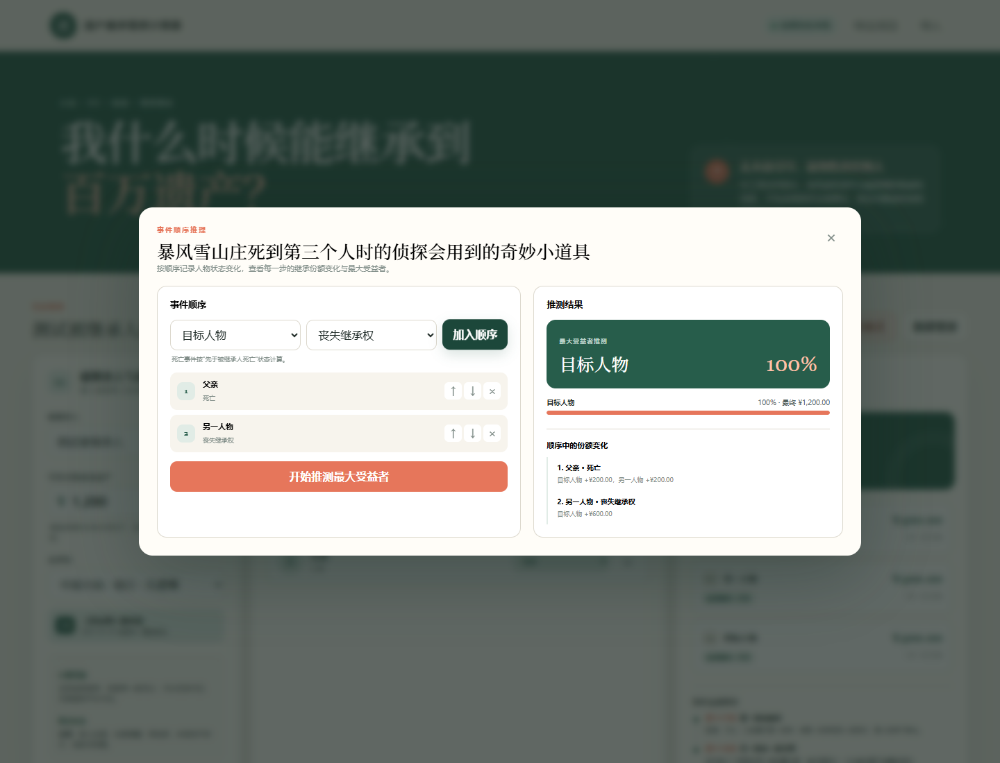

# 遗产继承情景计算器

一个面向小说、OC、CoC／CoJ跑团和其他虚构情景的本地无遗嘱继承计算器。它可以按国家、地区、州与年代切换法律包，记录死者性别，计算继承顺位、代位／代表路径、固定法定遗赠、财产分类和金额，并让亲戚关系计算器同步切换称谓与法律分类。

本项目的程序代码由 AI 生成；产品构思、界面文案、调试与发布由本人完成。

[](https://ko-fi.com/tupetetodou)




## 内置法律包

### 中国

- 中国大陆｜2021-01-01 起：《民法典》继承编现行核心规则；
- 中国台湾｜1931-05-05 起：现行《民法》继承编；
- 中国香港｜1995-11-03 起：现行《无遗嘱者遗产条例》，包括非土地实产、HK$500,000／HK$1,000,000法定遗赠与余产比例；
- 中国澳门｜1999-11-01 起：现行《民法典》第五卷，包括合资格事实婚伴侣与全血／半血兄弟姐妹权重；
- 中华民国大陆时期：1931年起的代表模型，包括当时养子女的特殊份额。

### 日本

- 2013-09-05 起：非婚生子女平等规则适用后的现行法；
- 1981—2013年改革期；
- 1948—1980年战后昭和旧比例；
- 1926—1947年战前昭和旧民法家督继承；
- 1912—1926年大正旧民法家督继承；
- 江户武家家产代表模型；
- 战国武家家产代表模型。

江户与战国法律包为跑团代表模型，非覆盖所有身份、领地和阶层的全国统一继承规则。大正与战前昭和法律包采用“家督／家产的一人承继”模型，非普通财产继承的完整历史复原。

### 美国

现行州法优先选择CoC常见地区：

- 马萨诸塞州｜2012-03-31 起；
- 罗德岛州｜2014-07-01 起；
- 纽约州｜1992-09-01 起；
- 康涅狄格州｜1985-07-01 起；
- 缅因州｜2019-09-01 起；
- 新罕布什尔州｜2021-07-01 起；
- 佛蒙特州｜2018-07-01 起；
- 加利福尼亚州｜1991-07-01 起。

另有马萨诸塞、罗德岛和纽约的1920年代代表法律包。1920年代法律包已将动产、不动产所有权和寡妇／鳏夫终身地产权分开，但具体死亡年份、终身地产权的放弃、宅地、寡妇津贴及修法切点请自行考证。

### 英国

- 1890年代英格兰与威尔士维多利亚代表法律包：区分死者性别、动产与不动产。男性死者使用遗孀的动产份额和寡妇终身地产权；女性死者使用丈夫的动产权益和鳏夫终身地产权；不动产所有权采用男性长子优先的代表路线。

女性死者分支把1883年后的独立财产计入遗产；生存丈夫取得动产；勾选“与当前生存配偶的共同子女”后另列鳏夫终身地产权。限嗣继承的不动产、授产安排、公簿持有地以及苏格兰或爱尔兰规则不在本模型内。

## 功能

### 二级法律包菜单

先选择国家，再从第二级菜单选择地区、州或年代。切换法律包会同步更新：

- 法定继承计算；
- 人物关系分类；
- 添加人物时出现的特殊身份字段；
- 默认货币；
- 亲戚关系计算器的称谓与法律分类；
- 当前法律包的范围、假设与未覆盖事项。

### 省略／详细财产模式

省略模式只输入一个清算后的净遗产金额。详细模式可分别勾选并填写：

- 个人生活动产；
- 个人其他动产；
- 个人不动产；
- 共同财产中的动产；
- 共同财产中的不动产；
- 死者占共同财产的百分比。

共同财产输入的是总值，只有按所填百分比切出的死者份额会进入遗产。香港法律包会单独处理个人生活动产；加州法律包会分开处理共同财产与单独财产；罗德岛、1920年代美国及维多利亚法律包会分开处理动产和不动产。

### 法律包动态人物字段

同一情景中的人物姓名不得重复。

人物分组使用各法律包自己的法定顺序或亲属类别：中国大陆使用第一、第二顺序，其他法律包不套用同一套分组名称。

字段只在相关法律包和关系下出现：

- 死者性别：男性／女性；
- 女性、出生／排行顺序；
- 非婚生子女；
- 养子女／收养后代；
- 指定家督／家产承继人；
- 与当前生存配偶的共同子女；
- 配偶另有非死者的后代；
- 半血缘兄弟姐妹或旁系；
- 澳门四年以上事实婚资格。

多名生存配偶同时存在时，仅第一名参与计算，并显示多配偶警告。

### 特殊规则表达方式

- 女性继承权在大正／战前昭和法律包中有特殊规则。未勾选任何“女性”选项时，继承次序不区分性别；勾选后，同亲等男性通常优先，女性在没有更优先者或被指定时可以承继。
- 民国1931模型中，有亲生直系卑亲属时，养子女按半权重参与；女儿与儿子同一顺序。
- 日本1948—2013模型中，非婚生子女按当时规则使用半权重；现行法律包中婚生与非婚生子女同份。
- 香港的全血与半血支系属于不同顺位组；澳门同一兄弟姐妹顺位中，全血支系按半血支系两倍权重。
- 维多利亚法律包中，女儿会参与动产分配，但不动产会先检查男性长子；没有儿子时女儿作为共同继嗣人。
- 维多利亚女性死者分支中，丈夫取得动产；勾选共同子女后，丈夫对不动产的鳏夫终身地产权另行显示。
- 美国若干现行州的配偶份额取决于子女是否为共同后代，以及生存配偶是否另有后代。

### 继承计算与情景工具

- 支持生存、先亡、放弃继承、丧失继承资格四种状态；
- 自动判断当前血亲类别、代位／代表支系、比例与金额；
- 固定法定遗赠先扣除，再按余额比例分配；
- 终身／使用权益独立展示，不重复加进不动产所有权金额；
- 反向求解可以寻找达到目标金额的最少“先亡”状态改变；
- 暴风雪山庄模式可按事件顺序重算，并按累计正向收益推测最大受益者。

反向求解最多枚举14名人物；人物较多时会限制最大状态变化数量。历史法律包与含司法裁量的情景仅适合剧情推演。

### 亲戚关系计算器

从死者开始最多选择四步关系链。称谓与法律分类随当前法律包改变：

- 中国法律包使用伯、叔、姑、舅、姨、堂、表、侄、外甥等中文称谓；
- 日本法律包使用日文亲属概念及读音，并区分现代相続顺位与旧家督候选分类；
- 美国和维多利亚法律包使用中英对照的英美称谓，以及后代、父母的后代、最近亲、不动产法定继承人等分类。

### 本地项目

- 自动保存到浏览器 `localStorage`；
- 可导出、导入JSON情景文件；
- 旧版v2本地数据会自动迁移到v3结构；
- 支持人民币、新台币、港币、澳门元、美元、英镑、欧元、日元和韩元显示。

## 使用方法

本项目没有第三方运行依赖。Windows可双击 `启动计算器.cmd`；macOS、Linux或其他桌面环境可用现代浏览器直接打开 `index.html`。

也可用Node.js 18或更高版本启动只监听本机回环地址的静态服务器：

```bash
npm start
```

然后访问 `http://127.0.0.1:4173`。

## 计算说明

所有法律包都用于虚构创作和情景模拟，不构成法律意见。除法律包单独写明的规则外，通常不处理遗嘱、遗留分／特留分、胎儿份额、同时死亡、转继承、放弃或丧失资格后的全部法定后果、债务与税费、亲子／收养效力争议、家庭津贴、宅地豁免、冲突法及法院裁量。

“共同财产”是跨法域的录入工具，不代表每个法域都有同一种共同财产制度。用户需要先确定财产所有权；计算器只把死者所占比例送入继承池。

## 主要规则来源

- 中国大陆：《民法典》继承编第1126—1130条；
- 中国台湾：法务部全国法规资料库《民法》第1138—1144条；
- 中国香港：电子版香港法例第73章《无遗嘱者遗产条例》；
- 中国澳门：《民法典》第五卷第1973、1979、1982—1987条；
- 日本：现行《民法》继承编、1980年法律第51号、旧民法及日本国立公文书馆武家继嗣资料；
- 美国：各州立法机关现行法典；
- 维多利亚英格兰与威尔士：《1670年遗产分配法》（Statute of Distribution 1670）、《1833年继承法》（Inheritance Act 1833）、《1882年已婚妇女财产法》（Married Women’s Property Act 1882）、《1890年无遗嘱者遗产法》（Intestates’ Estates Act 1890）及相关寡妇／鳏夫终身地产权规则。

源码中的法律包会同时显示本次计算采用的条文名称、关键假设和警告。

## 开发

```bash
# 运行测试
npm test

# 根据 src/ 生成可直接打开的 bundle.js
npm run build

# 启动可选的本地服务器
npm start
```

项目没有第三方npm依赖。修改 `src/` 后需要运行 `npm run build`。

```text
inheritance-simulator/
├─ index.html
├─ styles.css
├─ bundle.js
├─ src/
│  ├─ app.js
│  ├─ engine.js
│  ├─ people.js
│  ├─ solver.js
│  ├─ storm-solver.js
│  └─ law-packs/
│     ├─ cn-mainland-2021.js
│     └─ catalog.js
├─ tests/
├─ build.mjs
└─ server.mjs
```

## Ko-fi

如果这个工具对你有帮助，可以在 [Ko-fi](https://ko-fi.com/tupetetodou) 支持我的项目。我也在那里发布和出售手作海豹骰子。

[](https://ko-fi.com/tupetetodou)
